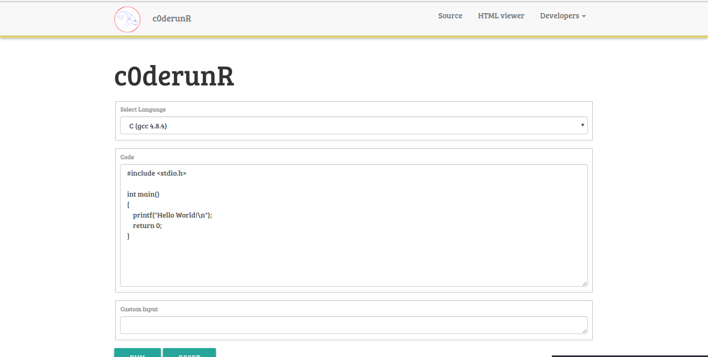

# c0derunR
[](http://forthebadge.com)  [](http://forthebadge.com)

[](http://makeapullrequest.com)
> Online Code Compliler / Interpreter.


An attempt at cleaner, minimal UI for coding, because no distractions. Made in
python. [Live Website](http://c0derunr.herokuapp.com).

Online platforms like HackerEarth, HackerRank, Codechef have their own IDE's, but we aim for minimal disturbance. Also supports live HTML rendering [here](http://c0derunr.herokuapp.com/htmlviewer).

Deployed here : http://c0derunr.herokuapp.com

## Convenient screenshot

* IDE



* HTMLViewer


## Usage

```sh
sudo chmod a+x run.sh # only for the first time
sudo ./run.sh
```
You don't need to really install anything. `run.sh` takes care of everything. Really.

## Contributing

Your contributions are always welcome :smile: ! Please have a look at the [contribution guidelines](CONTRIBUTING.md) first.

Before working on an issue / feature, it is **crucial** that you're assigned the task on a GitHub issue.
* If a relevant issue already exists, discuss on the issue and get yourself assigned on GitHub.
* If no relevant issue exists, open a new issue and get it assigned to yourself on GitHub.
Please proceed with a Pull Request only after you're assigned. It'd be a waste of your time as well as ours if you have not contacted us before hand when working on some feature / issue.

## Humans involved

* [Gaurav Sahu](https://github.com/demfier)
* [Surya Midatala](https://github.com/kingofools)
* [Kaustubh Hiware](https://github.com/kaustubhhiware)

## The Why
Code.Fun.Do 2017. Also python :heart:.

## License
The MIT License (MIT) 2017 - [Gaurav Sahu](https://github.com/demfier), [Surya Midatala](https://github.com/kingofools), [Kaustubh Hiware](https://github.com/kaustubhhiware).
Blow yourself off. Although it would be nice of you to give us some credit. Please have a look at the [LICENSE.md](LICENSE.md) for more details.

Logo credits - Surya himself.
